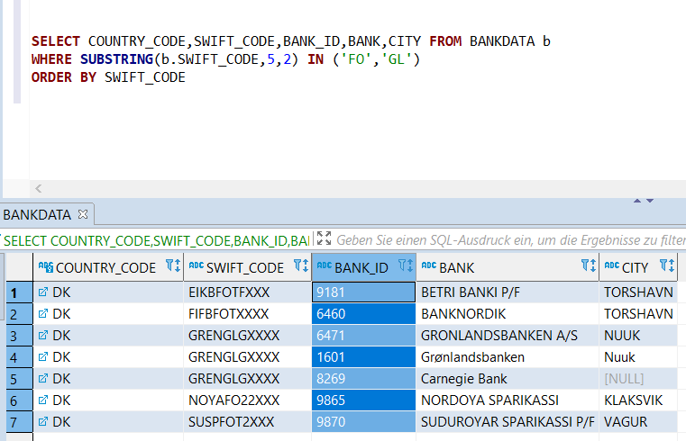

# Bankendaten

Eine Sammulung von Daten über Banken

Seit der Einführung der [S€PA](https://de.wikipedia.org/wiki/Europ%C3%A4ischer_Zahlungsraum#Teilnehmerl%C3%A4nder) und der [IBAN-Pflicht](https://de.wikipedia.org/wiki/Internationale_Bankkontonummer#IBAN-Pflicht) wissen wir nicht mehr genau, wohin wir Geld überweisen. Ja, aus der IBAN `MC58 1166 8400 0112 3456 7890 191` können wir herauslesen, dass unser Geschäftspartner ein Konto in Monaco hat. 

- aber welche Bank ist es? es gibt viele Banken in Monaco.
- mit etwas google'n identifizieren wir den `"bank_code":11668` und `"branch_code":40001`. Mehr nicht.
- wie erfährt man aus der IBAN die [BIC](https://de.wikipedia.org/wiki/ISO_9362), die uns dann zur Bank, der Adresse oder den Kontaktdaten führen könnte?

Das Beispiel stammt aus [iban.com-API](https://github.com/klst-de/iban.com-API/blob/master/README.md), wo auch die Auflösung steht.

Pro IBAN-Land wird hier die Sammlung aufgebaut. Später kommen die nicht IBAN-Länder hinzu. Die Daten dazu kann man in Projekten wie [swiftcode](https://github.com/Thomanphan/swiftcode) finden. 

DE Beispiel: die Bundesbank listet ca 16Tsd Einträge, 3600 davon sind "bankleitzahlführender Zahlungsdienstleister". Nur diese werden in die Liste übernommen.

Die [iban registry](https://www.iso13616.org/) (Release 87 – May 2020) listet 77 Länder. Etwa die Hälfte sind bereits in der Sammlung.

### Qualität der Daten

Die Daten werden aus iban.com gewonnen. Zur Datenqualität läßt sich also nicht viel sagen. Stichproben lassen Zweifel aufkommen. Beispiele:

* AD: "Banca Privada d'Andorra" wird mit `BSANADAD` gelistet, obwohl die gleichnamige Bank im April 2015 aufgelöst wurde, nachdem sie von der [FinCEN](https://de.wikipedia.org/wiki/FinCEN_Files) wegen Geldwäsche belangt wurde. Die [verdächtige Bank](https://thebanks.eu/banks/17738) hat allerdings eine andere BIC: `CASBADAD`

* BE: [bank 653 `BARCBEBB`](https://github.com/homebeaver/bankdata/commit/344d3a647fd216d6e623181677c3c95cabeecd0b#commitcomment-44195289) fehlt 

* CH/LT: warum kann es CH-IBANs für das Litauische E-Geld-Institut [`VIPULT22`](https://thebanks.eu/emis/via-payments-354733) geben? Gleiches gilt für die schwedische SEB [`ESSESESS`](https://thebanks.eu/banks/17570). Ebeso werden für alle DK-Banken IBANs beginnend mit `FO` bzw. `GL` als gültig angesehen (siehe Anomalien).

### IBAN-BIC [Anomalien](Anomalien.md)

Die Länderkennung findet sich nicht nur in der IBAN, sondern auch im [SWIFT-BIC](https://de.wikipedia.org/wiki/ISO_9362). Dabei kommt es zu [Anomalien](https://de.wikipedia.org/wiki/ISO_9362#Unzul%C3%A4nglichkeiten), die sich in der Sammlung wiederspiegeln.

Beispiele:

* CH/DE: im Grenzgebiet zur Schweiz bieten einige Institute ein CHF-Konto mit Schweizer IBAN. Die Sparkasse Hochrhein `SKHRDE6W` bietet ein "Giro swiss" an und ist damit in der CH-Sammlung gelistet.
* CH/AT: auch die Kunden der deutschen FIL Fondsbank [`FFBKDEFF`](https://thebanks.eu/banks/11283) können ein Konto mit einer AT-IBAN führen. Wozu? Oder ist es umgekehrt: die Kunden der Wiener Filiale haben ein Konto mit DE-IBAN.

* Laut iban registry gibt es IBANs die mit `FO` bzw. `GL` beginnen. Da sich die Clearingstelle für Grönland (GL) in Dänemark (DK) befindet, findet man die GL Banken in der Dänemark-Sammlung. Die iban.com Datenbank liefert für jedes DK Institut gültige IBANs mit GL-Prefix, was sicher nicht korrekt ist. Gleiches gilt für FO – Faroe Islands.

### BIC - LEI

Als [LEI](https://de.wikipedia.org/wiki/Legal_Entity_Identifier) wird eine 20-stellige Kennung für Rechtsträger im Finanzmarkt bezeichnet. Viele Banken haben eine LEI, einige sogar mehrere.

Beispiele:

* `COBADEFFXXX`: die COMMERZBANK hat die LEI [851WYGNLUQLFZBSYGB56](https://search.gleif.org/#/record/851WYGNLUQLFZBSYGB56) und eine zweite für ehemals selbständige [comdirect bank](https://search.gleif.org/#/record/529900V761CIZ36SHR16)
* `VATIVAV1XXX`: POSTE VATICANE hat keine LEI
 